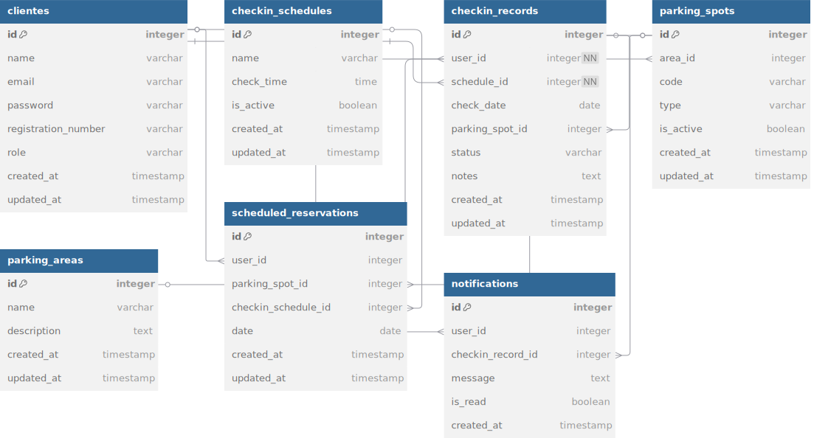

# Documento de Arquitetura Web (WAD)

## Sistema de Reserva de Estacionamento - Inteli

## Introdução

O Sistema de Reserva de Estacionamento do Inteli é uma aplicação web desenvolvida para atender às necessidades específicas da comunidade acadêmica do Instituto de Tecnologia e Liderança. O sistema permite que usuários reservem vagas de estacionamento antecipadamente, gerencia o fluxo de entrada e saída de veículos e fornece estatísticas detalhadas sobre a utilização do espaço de estacionamento.

### Objetivos do Sistema

- Otimizar a utilização do espaço de estacionamento disponível no campus
- Permitir a reserva antecipada de vagas por período (hora, turno ou dia inteiro)
- Gerenciar diferentes tipos de vagas (comuns, preferenciais, elétricas, etc.)
- Monitorar em tempo real a ocupação e disponibilidade de vagas
- Fornecer estatísticas e relatórios sobre utilização do estacionamento
- Notificar usuários sobre confirmações, cancelamentos e lembretes de reservas

### Escopo

O sistema gerencia o processo completo de reserva de estacionamento, desde a visualização de disponibilidade, criação de reservas, registro de entrada e saída de veículos, até a geração de relatórios de utilização. Ele é projetado especificamente para atender à comunidade do Inteli, utilizando autenticação com emails institucionais.

### Público-alvo

- Estudantes, professores e funcionários do Inteli que necessitam de vagas de estacionamento
- Administradores do sistema responsáveis pela gestão do estacionamento
- Visitantes autorizados que precisam de acesso temporário ao estacionamento

## Diagrama do Banco de Dados

### Entidades Principais

1. **Users (Usuários)**

   - Armazena dados dos motoristas e administradores
   - Inclui informações de autenticação, perfil e categoria de usuário (estudante, professor, visitante)

2. **ParkingAreas (Áreas de Estacionamento)**

   - Define diferentes setores do estacionamento (coberto, descoberto, VIP, etc.)
   - Permite configurações específicas para cada área

3. **ParkingSpots (Vagas de Estacionamento)**

   - Representa as vagas individuais disponíveis para reserva
   - Inclui informações sobre localização, tipo e status

4. **Vehicles (Veículos)**

   - Registra os veículos associados aos usuários
   - Contém informações como placa, modelo, cor e tamanho

5. **Reservations (Reservas)**

   - Gerencia as reservas de vagas realizadas pelos usuários
   - Inclui horário de início e fim, status e informações adicionais

6. **PaymentRecords (Registros de Pagamento)**

   - Registra os pagamentos para reservas que exigem taxa (visitantes, eventos especiais)
   - Armazena método de pagamento, valor e status

7. **AccessLogs (Registros de Acesso)**

   - Monitora a entrada e saída real de veículos
   - Permite comparação entre reservas e utilização efetiva

8. **Notifications (Notificações)**
   - Sistema de comunicação com os usuários
   - Envia alertas sobre reservas, pagamentos e mudanças de status

### Relacionamentos

- Um usuário pode ter múltiplos veículos cadastrados (1:N)
- Um usuário pode fazer múltiplas reservas (1:N)
- Uma vaga de estacionamento pertence a uma área específica (N:1)
- Uma reserva está associada a uma vaga específica (N:1)
- Uma reserva está associada a um veículo específico (N:1)
- Uma reserva pode ter um registro de pagamento associado (1:1)
- Uma reserva pode gerar múltiplos registros de acesso (1:N)
- Um usuário pode receber múltiplas notificações (1:N)

### Restrições Importantes

- Uma vaga não pode ter reservas sobrepostas para o mesmo período
- Apenas usuários com email institucional (@inteli.edu.br ou @sou.inteli.edu.br) podem fazer reservas regulares
- Visitantes precisam de autorização prévia e podem estar sujeitos a tarifas
- Cada categoria de usuário tem um limite máximo de horas de reserva por semana
- Reservas podem ser feitas com até 7 dias de antecedência para usuários regulares
- Cancellamentos com menos de 6 horas de antecedência podem resultar em penalidades
- Vagas específicas podem ser reservadas para veículos elétricos, acessibilidade ou cargos específicos

## Fluxos de Usuário

### Fluxo de Reserva de Vaga

1. Usuário acessa o sistema com suas credenciais
2. Sistema apresenta dashboard com visão geral das vagas disponíveis
3. Usuário seleciona data e período desejado para reserva
4. Sistema exibe mapa interativo das vagas disponíveis no período
5. Usuário seleciona uma vaga específica
6. Sistema solicita seleção do veículo (entre os cadastrados pelo usuário)
7. Usuário confirma a reserva
8. Sistema registra a reserva e envia confirmação por notificação/email

### Fluxo de Entrada no Estacionamento

1. Motorista chega à entrada do estacionamento
2. Sistema valida a reserva (via QR code, tag RFID ou manualmente)
3. Sistema registra o horário de entrada
4. Barreira de acesso é liberada (se aplicável)
5. Sistema atualiza o status da vaga para "ocupada"

### Fluxo de Saída do Estacionamento

1. Motorista dirige-se à saída do estacionamento
2. Sistema registra o horário de saída
3. Sistema calcula tempo de permanência e compara com a reserva
4. Para visitantes ou casos de extensão de permanência, realiza cobrança se necessário
5. Barreira de saída é liberada
6. Sistema atualiza o status da vaga para "disponível"

## Requisitos Não-Funcionais

1. **Segurança**
   - Autenticação de dois fatores para administradores
   - Criptografia de dados sensíveis
   - Registro detalhado de todas as operações (audit trail)

2. **Desempenho**
   - Tempo de resposta para consultas de disponibilidade menor que 2 segundos
   - Suporte para até 100 reservas concorrentes

3. **Disponibilidade**
   - Sistema deve operar 24/7 com disponibilidade mínima de 99,5%
   - Backup automático a cada 6 horas

4. **Escalabilidade**
   - Arquitetura que permita aumentar o número de vagas e áreas gerenciadas
   - Capacidade de expansão para múltiplos campi

5. **Usabilidade**
   - Interface responsiva para acesso via dispositivos móveis
   - Mapa interativo do estacionamento com código de cores para disponibilidade
   - Tempo máximo para concluir uma reserva: 3 minutos

6. **Compatibilidade**
   - Compatível com os principais navegadores (Chrome, Firefox, Safari, Edge)
   - API aberta para integração com outros sistemas institucionais
