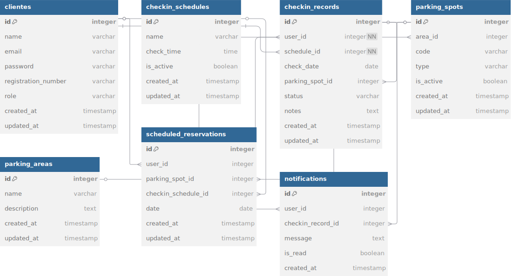

# Sistema de Reserva de Estacionamento - Inteli

## Descrição do Sistema

O Sistema de Reserva de Estacionamento é uma aplicação web desenvolvida para gerenciar o uso de vagas de estacionamento em instituições educacionais ou empresariais. O sistema permite a reserva antecipada de vagas, controle em tempo real da ocupação e oferece relatórios detalhados sobre a utilização do estacionamento.

### Características principais:

- **Reserva de Vagas**: Agendamento antecipado de vagas de estacionamento
- **Gerenciamento de Usuários**: Cadastro e controle de motoristas e administradores
- **Controle de Áreas**: Gestão das diferentes áreas e setores do estacionamento
- **Horários Flexíveis**: Possibilidade de reservas por hora, turno ou dia inteiro
- **Notificações**: Sistema de alerta para lembrar usuários sobre suas reservas
- **Relatórios**: Geração de relatórios de ocupação por horário, setor ou usuário

- SQL SE ENCONTRA NA PASTA 'DB'

## Estrutura de Pastas e Arquivos

```
./
├── .env.example             # Exemplo de variáveis de ambiente
├── .gitignore               # Arquivos ignorados pelo Git
├── assets/                  # Arquivos estáticos
│   └── modelo-banco.pdf     # Diagrama do banco de dados
├── config/                  # Arquivos de configuração
│   └── database.js          # Conexão com o banco de dados
├── controllers/             # Lógica de controle das requisições
│   └── HomeController.js    # Controlador da página inicial
├── docs/                    # Documentação do projeto
│   └── wad.md               # Web Application Document
├── db/                      # Banco sql
│   └── banco.sql            # Arquivo sql
├── jest.config.js           # Configuração de testes
├── models/                  # Definição dos modelos de dados
│   └── User.js              # Modelo de usuário
├── package-lock.json        # Versões exatas das dependências
├── package.json             # Dependências do projeto
├── readme.md                # Documentação do projeto (este arquivo)
├── rest.http                # Testes de API
├── routes/                  # Definição das rotas do sistema
│   └── index.js             # Rotas principais
├── scripts/                 # Scripts do frontend
├── server.js                # Arquivo principal que inicializa o servidor
├── services/                # Serviços auxiliares
│   └── parkingService.js    # Serviço para gerenciamento de vagas
├── styles/                  # CSS do frontend
└── tests/                   # Testes automatizados
```

## Modelo de Dados

O sistema utiliza um banco de dados relacional com as seguintes entidades principais:

- **Users**: Armazena informações dos usuários (motoristas e administradores)
- **ParkingAreas**: Define as diferentes áreas do estacionamento (coberto, descoberto, VIP, etc.)
- **ParkingSpots**: Representa as vagas individuais disponíveis para reserva
- **Vehicles**: Registra os veículos dos usuários (placa, modelo, cor)
- **Reservations**: Gerencia as reservas de vagas realizadas pelos usuários
- **PaymentRecords**: Registra os pagamentos relacionados às reservas (quando aplicável)
- **Notifications**: Sistema de notificação para alertar usuários sobre suas reservas

O diagrama do banco de dados está disponível em <a href="./assets/modelo-banco.pdf">`assets/modelo-banco.pdf`</a>.<br>



## Como Executar o Projeto Localmente

### Pré-requisitos

- Node.js (v14 ou superior)
- npm ou yarn
- PostgreSQL (para o banco de dados)

### Passos para Execução

1. Clone o repositório:

```bash
git clone git@github.com:katz2009/banco-de-dados-.git
cd banco-de-dados-
```

2. Instale as dependências:

```bash
npm install
```

3. Configure as variáveis de ambiente: **(ainda não necessário).**

```bash
cp .env.example .env
# Edite o arquivo .env com seus dados de conexão ao banco
```

4. Crie o banco de dados: (**ainda não necessário).**

```bash
# Execute o SQL disponível na documentação para criar o schema
psql -U seu_usuario -d nome_do_banco -f schema.sql
```

5. Execute o servidor:

```bash
npm start
```

6. Acesse o sistema no navegador:

```
http://localhost:3000 ou http://127.0.0.1:3000/
```

## Funcionalidades Principais

- Visualização de vagas disponíveis em tempo real
- Reserva de vagas por período (hora, turno ou dia)
- Registro de entrada e saída de veículos
- Cancelamento e alteração de reservas
- Notificações sobre status das reservas
- Relatórios de ocupação e utilização

## Tecnologias Utilizadas

- **Backend**: Node.js, Express
- **Banco de Dados**: PostgreSQL
- **Frontend**: HTML, CSS, JavaScript

## Testes

Para executar os testes, utilize o comando:

```bash
npm test
```

## Documentação Adicional

A documentação completa da arquitetura web está disponível em <a href="./docs/wad.md">`docs/wad.md`</a>.